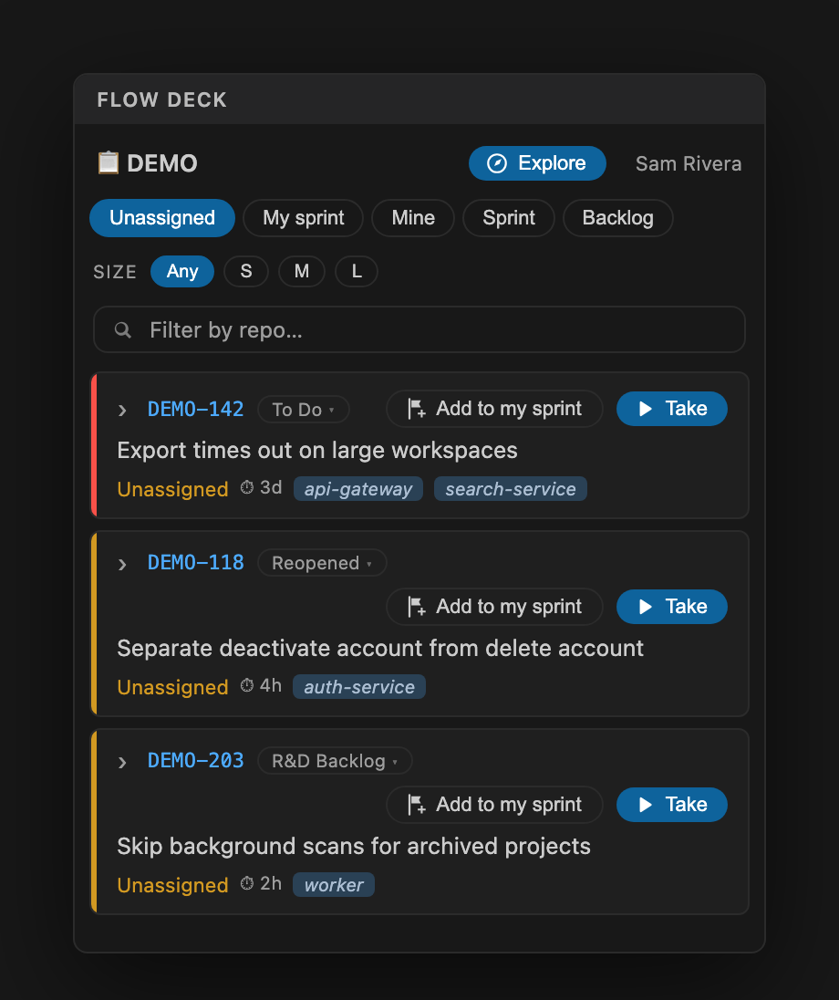

<div align="center">


# Agent Flow

**Grab a Jira task and spin up its workspace** — a task pool in your VS Code / Cursor
sidebar that opens the right repos and pre-seeds a Claude Code agent.

[](https://github.com/oznasi1/agent-flow/actions/workflows/ci.yml)
[](LICENSE)




</div>

---

Agent Flow turns *"what should I work on?"* into a workspace with an agent already primed.

Pick a Jira task → it infers which repos the task touches → opens them as a workspace →
seeds a task brief and pre-fills a Claude Code agent with the plan. You land ready to
orchestrate, not ready to set up.

## What it does

- **Sidebar task pool** (webview) with filter tabs (My sprint · Unassigned · Mine ·
  Sprint · Backlog) and a size lens (S/M/L by original estimate). The size lens, status
  lens, and repo search can each be hidden if you don't use them (`agentFlow.filters.size` /
  `.status` / `.repo`, all on by default).
- **Jira fetch** over the REST API. Reads are the default; the only writes are optional
  status changes from a card — which also stamp a provenance label (default `claude-code`,
  configurable via `agentFlow.provenanceLabel`, toggle with `agentFlow.stampLabelOnWrite`).
- **Service inference** — reads the ticket's components/labels/text and matches your
  local repo checkouts (backend *and* frontend).
- **Open + seed** — writes `.pick-task/TASK.md` into each repo (git-excluded), generates a
  `<KEY>.code-workspace` (or one window per repo, or a per-task git worktree), and pre-fills
  the Claude Code panel with your chosen prompt mode (you press Enter to start).
- **Address PR** — once a task reaches your PR-review status (default `PR initiated`), an
  **Address PR** button appears on the card. It kicks off an agent **in a worktree** that finds
  the task's GitHub PR by its Jira key, checks out its branch, and assesses whether it's ready
  for your fixes — then, by default, starts implementing the requested changes (toggle with
  `agentFlow.prReviewAutoFix`).

## Quick start

> Agent Flow ships with **no organization-specific defaults** — everything you need is
> collected in a short first-run wizard.

1. **Install the extension.**
   - Build or grab the packaged `.vsix` (see [Develop / run](#develop--run) or
     [CONTRIBUTING.md](CONTRIBUTING.md)), then:
     ```bash
     code --install-extension oznasi1-agent-flow-<version>.vsix
     ```
     …or in the Extensions view use **⋯ → Install from VSIX…**.
   - _(Once published, you'll also be able to install it from the VS Code Marketplace.)_
2. **Install the [Claude Code extension](https://marketplace.visualstudio.com/items?itemName=anthropic.claude-code)**
   (`anthropic.claude-code`) — Agent Flow seeds its agent panel. Without it, the task brief
   is still written and used as a fallback.
3. **Open the Agent Flow icon** in the activity bar. On first activation it offers a guided
   setup — enter your Jira site, project key, and repos directory, then sign in with an
   [Atlassian API token](https://id.atlassian.com/manage-profile/security/api-tokens).
   (Re-run it anytime with **"Agent Flow: Run Setup…"**.)
4. **Pick a task** from the pool. Click a card to expand it — the inferred repos are
   pre-selected; adjust them, then press **▶ Take**.
5. **Land in a primed workspace.** Agent Flow opens the task's repos, drops a
   `.pick-task/TASK.md` brief into each, and pre-fills the Claude Code panel with your
   prompt — press **Enter** to start.

## Requirements

- **VS Code** (or Cursor) `^1.90.0`.
- The **Claude Code** extension (`anthropic.claude-code`) — for the agent seed (optional;
  the task brief is the guaranteed fallback).
- An **Atlassian API token** for your Jira Cloud account
  ([create one](https://id.atlassian.com/manage-profile/security/api-tokens)).

## Data & privacy

Agent Flow talks to **your** Jira Cloud site and reads your **local** repo checkouts —
nothing is sent to any third-party service. Your Jira credentials are stored in VS Code
**SecretStorage** (encrypted), never in `settings.json`. Reads are the default; the only
Jira **writes** are the optional status changes you trigger from a card (which stamp the
provenance label). Task briefs are written to a git-excluded `.pick-task/` directory in
each repo, so they never get committed.

## Settings

| Setting | Default | Notes |
|---------|---------|-------|
| `agentFlow.jira.baseUrl` | `""` | Your Jira Cloud site, e.g. `https://your-org.atlassian.net`. |
| `agentFlow.jira.project` | `""` | Jira project key, e.g. `ABC`. |
| `agentFlow.reposRoot` | `~/projects` | Where your repo checkouts live. |
| `agentFlow.workspaceDir` | `~/projects` | Where generated `.code-workspace` files go. |
| `agentFlow.repoBlocklist` | `[]` | Directory names under `reposRoot` to exclude from discovery. |
| `agentFlow.githubOrg` | `""` | Reserved (clone support not yet implemented). |
| `agentFlow.provenanceLabel` | `claude-code` | Label stamped on Jira writes when enabled. |
| `agentFlow.stampLabelOnWrite` | `true` | Whether to stamp the provenance label. |
| `agentFlow.defaultFilter` | `mysprint` | Default task filter lens (`unassigned`, `mysprint`, `mine`, `sprint`, `backlog`). |
| `agentFlow.seedAgent` | `true` | Pre-fill the Claude Code panel after opening. |
| `agentFlow.trackOpenWindows` | `true` | Track open windows so a task can open into one you already have open. |
| `agentFlow.prReviewStatus` | `PR initiated` | Task status (case-insensitive) that shows the **Address PR** button on a card. |
| `agentFlow.prReviewAutoFix` | `true` | After the PR-review agent assesses the PR, let it implement the requested changes (off = assess only). |

Plus `agentFlow.workspaceMode`, `agentFlow.taskMode`, `agentFlow.promptModes`,
`agentFlow.exploreMode`, `agentFlow.explorePrompts.*`, `agentFlow.prReviewPrompt`, and
`agentFlow.worktree` — see the Settings UI. The **Address PR** kick-off always runs in a
worktree. Per-task worktrees are created inside each repo at `.claude/worktrees/<KEY>`
(and git-excluded automatically).

### Where a task opens

`agentFlow.openIn` controls where a task you take gets opened: `ask` (ask each time),
`new-window`, `this-window` (reuse the current window), or `pick-existing` — pick an
existing `.code-workspace` file and have the task's repos merged into it. That merge is
non-destructive: Agent Flow only appends the repos the task needs (preserving the
workspace file's existing folders, settings, and formatting) and opens it as a
multi-root workspace; it never overwrites or removes what was already there.

When taking a task (or starting an Explore session) with `agentFlow.openIn` set to
`ask`, Agent Flow also lists the windows you already have open — a repo folder or a
saved workspace — so you can drop the task straight into one of them. Choosing an open
**workspace** window merges the task's repos into it; choosing an open **folder** window
focuses it and seeds the agent there (a folder window can't gain root folders, so any
other repos the task touches keep their briefs but aren't added as roots). Set
`agentFlow.trackOpenWindows` to `false` to turn this off.

## Architecture

```
src/
├── extension.ts        # activation, commands, first-run + seed-on-activation hooks
├── setup.ts            # guided first-run configuration wizard
├── tasksView.ts        # webview provider + the pick→confirm→open flow
├── config.ts           # settings accessor
├── types.ts            # shared host ↔ webview message types
├── jira/
│   ├── auth.ts         # JiraAuth interface + ApiTokenAuth (SecretStorage)
│   └── client.ts       # REST client: JQL builder, search, getIssue, transitions
├── engine/
│   ├── repos.ts        # discover local repo checkouts
│   ├── infer.ts        # component/label/text → service matching
│   ├── worktree.ts     # per-task git worktrees + branch naming
│   └── workspace.ts    # briefs, .code-workspace, plan.json, open windows, agent seed
└── webview/            # React task-pool UI (bundled separately by esbuild)
```

Auth is behind the `JiraAuth` interface: v1 ships the API-token provider; the OAuth
web-flow provider (a `vscode.AuthenticationProvider` that opens the browser) drops in later
with no changes to the client or UI.

## Develop / run

```bash
npm install
npm run build        # or: npm run watch
npm test             # vitest
npm run typecheck    # tsc --noEmit
```

Press **F5** (Run Agent Flow) to launch an Extension Development Host with the extension
loaded. Open the **Agent Flow** icon in the activity bar and complete the first-run setup.

See [CONTRIBUTING.md](CONTRIBUTING.md) for the full command list and conventions.

## Status

v1 — task pool, filters, size lens, service inference, worktrees, open + seed, and status
changes from a card. The agent seed calls the Claude Code extension command
(`claude-vscode.primaryEditor.open`) with a URI-handler and clipboard fallback; the seeded
brief is the guaranteed fallback. Deferred: OAuth web sign-in, cloning not-yet-checked-out
repos, multi-project.

See [CHANGELOG.md](CHANGELOG.md) for the release history.

## Publishing

Before publishing to the VS Code Marketplace, confirm the `publisher` in `package.json`
matches your registered Marketplace publisher id and that a 128×128 PNG `icon` is set. See
[CONTRIBUTING.md](CONTRIBUTING.md#publishing-maintainers).

## Contributing

Contributions are welcome — see [CONTRIBUTING.md](CONTRIBUTING.md).

## License

[MIT](LICENSE) © 2026 Oz Nasi ([oznasi1](https://github.com/oznasi1)) and At-Bay.
