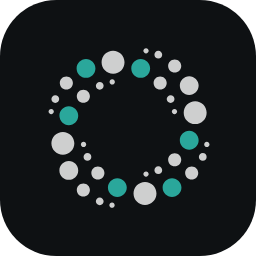

<div align="center">



# Agent Flow

**Grab a Jira task and spin up its workspace** — a task pool in your VS Code / Cursor
sidebar that opens the right repos and pre-seeds a Claude Code agent.

[](https://github.com/oznasi1/agent-flow/actions/workflows/ci.yml)
[](LICENSE)


</div>

---

Agent Flow turns *"what should I work on?"* into a workspace with an agent already primed.

Pick a Jira task → it infers which repos the task touches → opens them as a workspace →
seeds a task brief and pre-fills a Claude Code agent with the plan. You land ready to
orchestrate, not ready to set up.

## What it does

- **Sidebar task pool** (webview) with filter tabs (My sprint · Unassigned · Mine ·
  Sprint · Backlog) and a size lens (S/M/L by original estimate). The size lens, status
  lens, and repo search can each be hidden if you don't use them (`agentFlow.filters.size` /
  `.status` / `.repo`, all on by default).
- **Jira fetch** over the REST API. Reads are the default; the only writes are optional
  status changes from a card — which also stamp a provenance label (default `claude-code`,
  configurable via `agentFlow.provenanceLabel`, toggle with `agentFlow.stampLabelOnWrite`).
- **Service inference** — reads the ticket's components/labels/text and matches your
  local repo checkouts (backend *and* frontend).
- **Open + seed** — writes `.pick-task/TASK.md` into each repo (git-excluded), generates a
  `<KEY>.code-workspace` (or one window per repo, or a per-task git worktree), and pre-fills
  the Claude Code panel with your chosen prompt mode (you press Enter to start).
- **Address PR** — once a task reaches your PR-review status (default `PR initiated`), an
  **Address PR** button appears on the card. It kicks off an agent **in a worktree** that finds
  the task's GitHub PR by its Jira key, checks out its branch, and assesses whether it's ready
  for your fixes — then, by default, starts implementing the requested changes (toggle with
  `agentFlow.prReviewAutoFix`).
- **Launch in parallel** — narrow the repo filter to a single repo and a checkbox
  appears on each task. Tick several, then **Launch in parallel**: each task opens
  in its own git worktree (its own branch) in its own window, with its own Claude
  Code session pre-seeded — several agents working the same repo at once. Batches
  larger than `agentFlow.batchLaunchConfirmThreshold` (default 6) ask first.

### The Deck — your in-flight board

Once you've taken tasks, the **Deck** (open it with **"Agent Flow: Open the Deck
(in-flight)"**) is the board of everything you've launched, in a classic pipeline —
**In progress · Needs you · In review · Done**.


The columns are a neutral git + Jira backbone; each **card** carries the true live state.
A best-effort **Live signal** (read from your local Claude Code transcripts) tells `working ·
Ns ago` from `idle`, `ended turn` (needs you), or `parked` — turn it off and cards fall back
to git + Jira only. **Open** focuses the window if it's already open (never a duplicate) and
opens it fresh otherwise; **Diff** shows the working diff; **⋯** offers *Open in Jira* and
*Forget*.

### The Marketplace — browse your skills, commands & agents

The **Marketplace** (open it with the puzzle-piece (`$(extensions)`) button beside the
Deck's button in the sidebar title bar, or **"Agent Flow: Open the Marketplace"**) is a
searchable browser of everything Claude Code can do on this machine. It reads your local
`~/.claude` — the marketplaces you've added, the plugins you've installed, and the skills,
slash commands, agents and hooks inside them — plus any skills or commands you wrote
yourself in `~/.claude` or in the open workspace's `.claude/`.


Search is fuzzy and ranked — `revw` finds `/review`, `mkpl` finds `marketplace` — with the
best match selected as you type and the type tallies following the query. From the search
box, **↑/↓** move the selection and **Enter** opens its file. When you aren't searching,
the list groups into **category sections** read from each plugin's own manifest —
Development, Monitoring, Deployment, and so on — with everything you wrote yourself under
**Yours** first, the rest ordered by descending size, and anything whose manifest omits
the field under **Uncategorized** last. Click a section header to focus that category.

Narrow further by type, by what's installed or enabled, by **several plugins at once**
(the searchable `Plugins ▾` picker, or click a plugin name in any row), or by marketplace
(click its tag). Query, type, scope, category, plugins and marketplace all AND together,
and active selections show up as removable chips with a **Clear** action — the chip row
disappears when nothing is selected.


It also shows which plugins are disabled, and lists the plugins your marketplaces
catalogue but haven't downloaded yet, with the `/plugin install` command to get them.

Selecting a row **renders its file** in the pane on the right, under the metadata — a
skill's `SKILL.md`, a hook's `hooks.json` as a fenced JSON block, a plugin's README — so
you can read what something actually does without opening it; **Open file** still opens it
in an editor tab, **Reveal in Finder** shows it on disk, and **Copy** grabs the command
you'd type to use it. Files over 262,144 characters are truncated, with the same **Open
file** button covering the rest in the editor. The renderer builds elements from a parsed
tree instead of injecting HTML, so a hostile file from a third-party marketplace can't run
anything; only `http`/`https` links become clickable.

The panel is **read-only and offline** — it never writes to `~/.claude`, never runs
`/plugin install`, and makes no network calls. **⟳ Rescan** re-reads the disk (so does
coming back to the panel after a pause), and **+ Add a marketplace** copies the
`/plugin marketplace add owner/repo` command for you to run in Claude Code itself — new
marketplaces show up here on the next scan.

## Quick start

> Agent Flow ships with **no organization-specific defaults** — everything you need is
> collected in a short first-run wizard.

1. **Install the extension.**
   - Build or grab the packaged `.vsix` (see [Develop / run](#develop--run) or
     [CONTRIBUTING.md](CONTRIBUTING.md)), then:
     ```bash
     code --install-extension oznasi1-agent-flow-<version>.vsix
     ```
     …or in the Extensions view use **⋯ → Install from VSIX…**.
   - _(Once published, you'll also be able to install it from the VS Code Marketplace.)_
2. **Install the [Claude Code extension](https://marketplace.visualstudio.com/items?itemName=anthropic.claude-code)**
   (`anthropic.claude-code`) — Agent Flow seeds its agent panel. Without it, the task brief
   is still written and used as a fallback.
3. **Open the Agent Flow icon** in the activity bar. On first activation it offers a guided
   setup — enter your Jira site, project key, and repos directory, then sign in with an
   [Atlassian API token](https://id.atlassian.com/manage-profile/security/api-tokens).
   (Re-run it anytime with **"Agent Flow: Run Setup…"**.)
4. **Pick a task** from the pool. Click a card to expand it — the inferred repos are
   pre-selected; adjust them, then press **▶ Take**.
5. **Land in a primed workspace.** Agent Flow opens the task's repos, drops a
   `.pick-task/TASK.md` brief into each, and pre-fills the Claude Code panel with your
   prompt — press **Enter** to start.

## Requirements

- **VS Code** (or Cursor) `^1.90.0`.
- The **Claude Code** extension (`anthropic.claude-code`) — for the agent seed (optional;
  the task brief is the guaranteed fallback).
- An **Atlassian API token** for your Jira Cloud account
  ([create one](https://id.atlassian.com/manage-profile/security/api-tokens)).

## Data & privacy

Agent Flow talks to **your** Jira Cloud site and reads your **local** repo checkouts —
nothing is sent to any third-party service. Your Jira credentials are stored in VS Code
**SecretStorage** (encrypted), never in `settings.json`. Reads are the default; the only
Jira **writes** are the optional status changes you trigger from a card (which stamp the
provenance label). Task briefs are written to a git-excluded `.pick-task/` directory in
each repo, so they never get committed.

## Settings

| Setting | Default | Notes |
|---------|---------|-------|
| `agentFlow.jira.baseUrl` | `""` | Your Jira Cloud site, e.g. `https://your-org.atlassian.net`. |
| `agentFlow.jira.project` | `""` | Jira project key, e.g. `ABC`. |
| `agentFlow.reposRoot` | `~/projects` | Where your repo checkouts live. |
| `agentFlow.workspaceDir` | `~/projects` | Where generated `.code-workspace` files go. |
| `agentFlow.repoBlocklist` | `[]` | Directory names under `reposRoot` to exclude from discovery. |
| `agentFlow.githubOrg` | `""` | Reserved (clone support not yet implemented). |
| `agentFlow.provenanceLabel` | `claude-code` | Label stamped on Jira writes when enabled. |
| `agentFlow.stampLabelOnWrite` | `true` | Whether to stamp the provenance label. |
| `agentFlow.defaultFilter` | `mysprint` | Default task filter lens (`unassigned`, `mysprint`, `mine`, `sprint`, `backlog`). |
| `agentFlow.seedAgent` | `true` | Pre-fill the Claude Code panel after opening. |
| `agentFlow.trackOpenWindows` | `true` | Track open windows so a task can open into one you already have open. |
| `agentFlow.prReviewStatus` | `PR initiated` | Task status (case-insensitive) that shows the **Address PR** button on a card. |
| `agentFlow.prReviewAutoFix` | `true` | After the PR-review agent assesses the PR, let it implement the requested changes (off = assess only). |
| `agentFlow.remoteControl` | `off` | Offer Claude Code's **Remote Control** for the session Agent Flow opens (`off` / `on` / `ask`), so you can drive it from claude.ai or the Claude mobile app. |

Plus `agentFlow.workspaceMode`, `agentFlow.taskMode`, `agentFlow.promptModes`,
`agentFlow.exploreMode`, `agentFlow.explorePrompts.*`, `agentFlow.prReviewPrompt`, and
`agentFlow.worktree` — see the Settings UI. The **Address PR** kick-off always runs in a
worktree. Per-task worktrees are created inside each repo at `.claude/worktrees/<KEY>`
(and git-excluded automatically).

**Remote Control.** With `agentFlow.remoteControl` set to `on` or `ask`, the Claude Code
panel is pre-filled with `/remote-control <KEY>` instead of the task prompt, and the task
prompt goes to your clipboard: press Enter to connect the session, then paste and press
Enter to start the task. The Jira key names the remote session, so several are tellable
apart on claude.ai. It takes two steps because Claude Code can't run a slash command and a
prompt in one submission. Launches that open more than one window — a parallel batch, or a
per-window Take across several repos — keep the normal single-Enter seeding and say so,
since one clipboard can't carry a different prompt for each window.

### Where a task opens

`agentFlow.openIn` controls where a task you take gets opened: `ask` (ask each time),
`new-window`, `this-window` (reuse the current window), or `pick-existing` — pick an
existing `.code-workspace` file and have the task's repos merged into it. That merge is
non-destructive: Agent Flow only appends the repos the task needs (preserving the
workspace file's existing folders, settings, and formatting) and opens it as a
multi-root workspace; it never overwrites or removes what was already there.

When taking a task (or starting an Explore session) with `agentFlow.openIn` set to
`ask`, Agent Flow also lists the windows you already have open — a repo folder or a
saved workspace — so you can drop the task straight into one of them. Choosing an open
**workspace** window merges the task's repos into it; choosing an open **folder** window
focuses it and seeds the agent there (a folder window can't gain root folders, so any
other repos the task touches keep their briefs but aren't added as roots). Set
`agentFlow.trackOpenWindows` to `false` to turn this off.

## Architecture

```
src/
├── extension.ts        # activation, commands, first-run + seed-on-activation hooks
├── setup.ts            # guided first-run configuration wizard
├── tasksView.ts        # sidebar webview provider + the pick→confirm→open flow
├── deckView.ts         # the Deck panel: in-flight runs, live signal, open/diff
├── marketplaceView.ts  # the Marketplace panel: scan, file reads, open/reveal/copy
├── config.ts           # settings accessor
├── types.ts            # shared host ↔ webview message types
├── jira/
│   ├── auth.ts         # JiraAuth interface + ApiTokenAuth (SecretStorage)
│   ├── client.ts       # REST client: search, getIssue, transitions
│   └── jql.ts          # the JQL behind each filter lens
├── engine/             # the logic, kept out of the views so it can be tested directly
│   ├── repos.ts        # discover local repo checkouts
│   ├── infer.ts        # component/label/text → service matching
│   ├── worktree.ts     # per-task git worktrees + branch naming
│   ├── workspace.ts    # briefs, .code-workspace, plan.json, open windows, agent seed
│   ├── runs.ts         # what you've launched, for the Deck
│   ├── transcript.ts   # best-effort live agent state from ~/.claude/projects
│   ├── claudeAssets.ts # scan ~/.claude: marketplaces, plugins, skills, commands, hooks
│   ├── sections.ts     # the Marketplace's category order (Yours → size → Uncategorized)
│   ├── fuzzy.ts        # the ranked fuzzy match behind the Marketplace's search
│   └── markdown.ts     # the parse-to-tree markdown renderer behind the file preview
└── webview/            # React UIs — task pool, Deck, Marketplace (three esbuild bundles)
```

Auth is behind the `JiraAuth` interface: v1 ships the API-token provider; the OAuth
web-flow provider (a `vscode.AuthenticationProvider` that opens the browser) drops in later
with no changes to the client or UI.

## Develop / run

```bash
npm install
npm run build        # or: npm run watch
npm test             # vitest
npm run typecheck    # tsc --noEmit
```

Press **F5** (Run Agent Flow) to launch an Extension Development Host with the extension
loaded. Open the **Agent Flow** icon in the activity bar and complete the first-run setup.

See [CONTRIBUTING.md](CONTRIBUTING.md) for the full command list and conventions.

## Status

v1 — task pool, filters, size lens, service inference, worktrees, open + seed, and status
changes from a card, plus the **Deck** (the in-flight board) and the **Marketplace** (the
read-only browser over `~/.claude`). The agent seed calls the Claude Code extension command
(`claude-vscode.primaryEditor.open`) with a URI-handler and clipboard fallback; the seeded
brief is the guaranteed fallback. Deferred: OAuth web sign-in, cloning not-yet-checked-out
repos, multi-project.

See [CHANGELOG.md](CHANGELOG.md) for the release history.

## Publishing

Before publishing to the VS Code Marketplace, confirm the `publisher` in `package.json`
matches your registered Marketplace publisher id and that a 128×128 PNG `icon` is set. See
[CONTRIBUTING.md](CONTRIBUTING.md#publishing-maintainers).

## Contributing

Contributions are welcome — see [CONTRIBUTING.md](CONTRIBUTING.md).

## License

[MIT](LICENSE) © 2026 Oz Nasi ([oznasi1](https://github.com/oznasi1)) and At-Bay.
