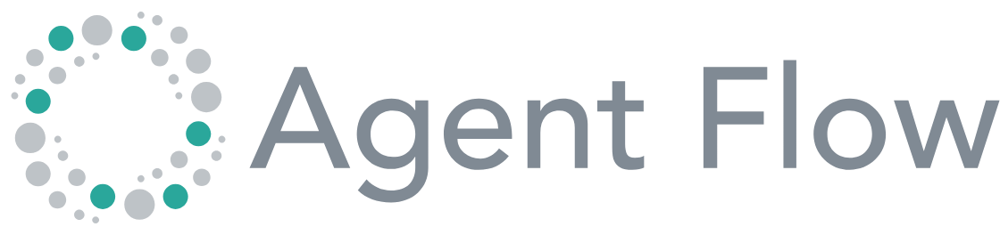
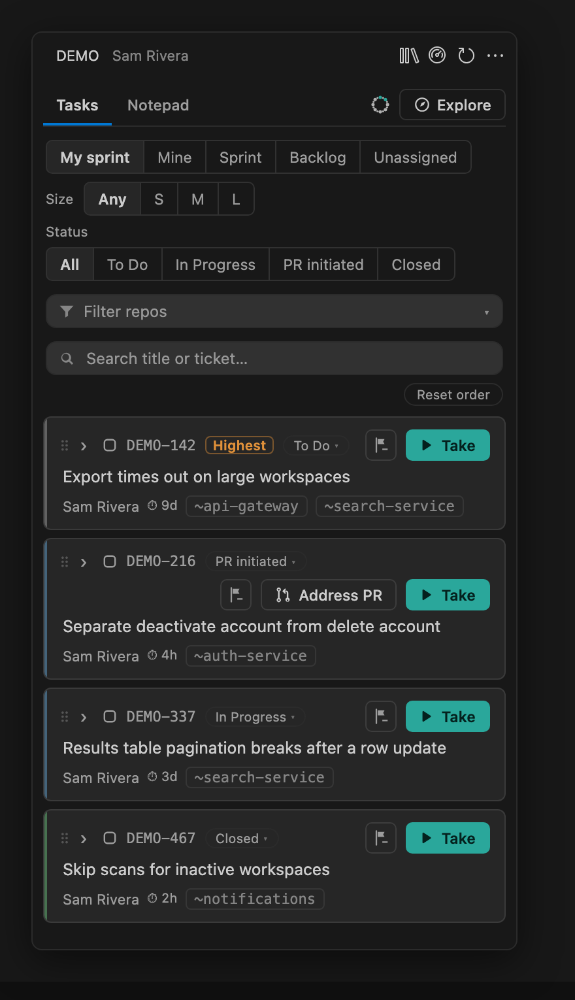
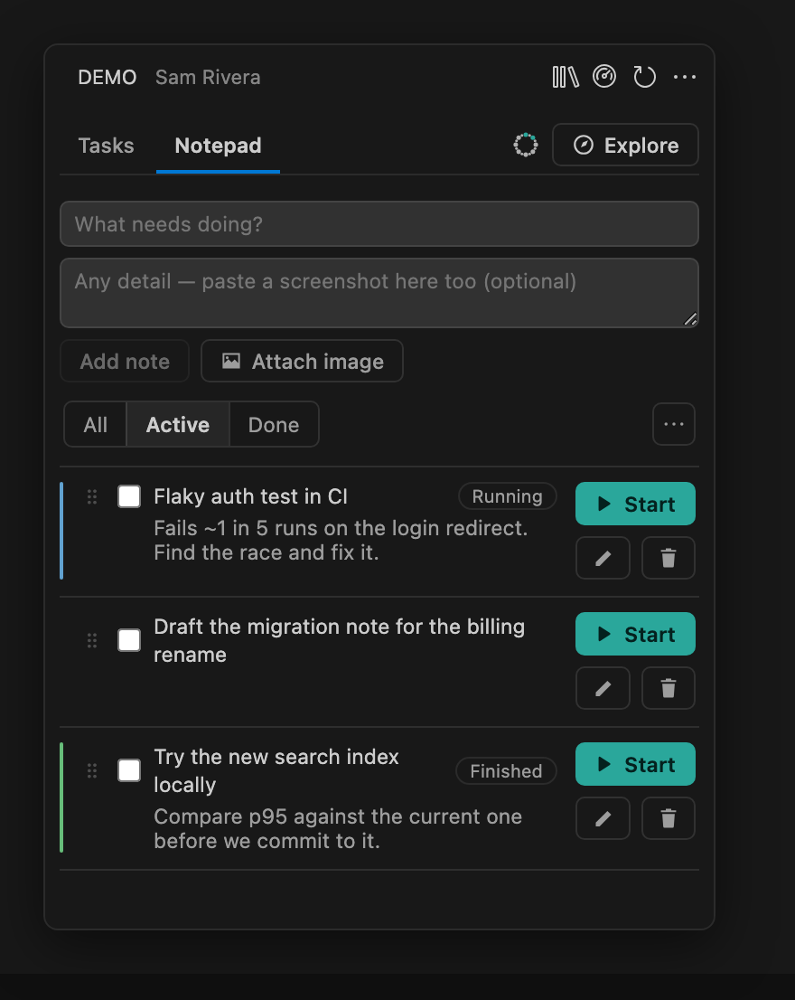
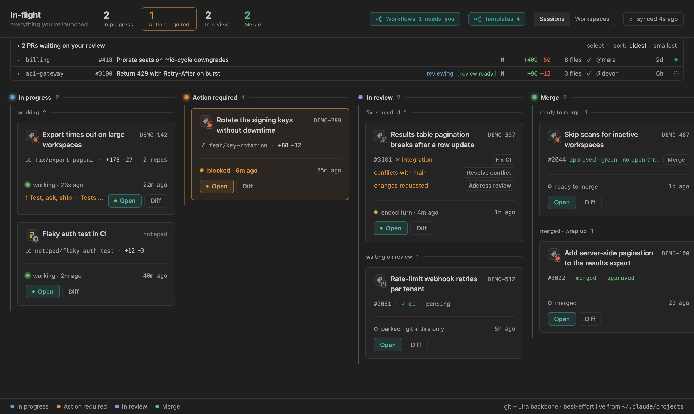
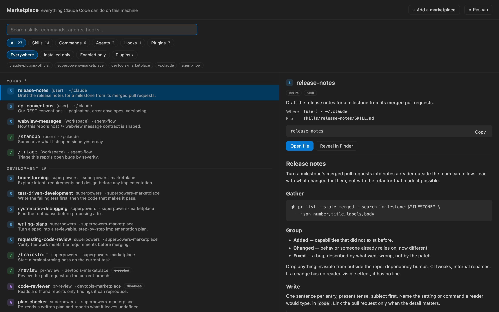

<div align="center">

<picture>
  <source media="(prefers-color-scheme: dark)" srcset="https://github.com/oznasi1/agent-flow/raw/HEAD/media/logo.png">
  <source media="(prefers-color-scheme: light)" srcset="https://github.com/oznasi1/agent-flow/raw/HEAD/media/logo-light.png">
  
</picture>

<p><strong>A task pool in your sidebar.</strong> Take a Jira ticket and it opens the repos
that ticket touches, with a coding tool already briefed — Claude Code, Copilot, or Cursor.</p>

[](https://github.com/oznasi1/agent-flow/actions/workflows/ci.yml)
[](https://marketplace.visualstudio.com/items?itemName=Oznasi1.oznasi1-agent-flow)
[](https://open-vsx.org/extension/Oznasi1/oznasi1-agent-flow)
[](LICENSE)

[](https://vscode.dev/redirect?url=vscode:extension/Oznasi1.oznasi1-agent-flow)
[](https://open-vsx.org/extension/Oznasi1/oznasi1-agent-flow)

[Quick start](#quick-start) · [Full guide](docs/GUIDE.md) · [Settings](docs/SETTINGS.md) · [Privacy](docs/PRIVACY.md) · [Changelog](CHANGELOG.md) · [Report an issue](#feedback)



</div>

---

Agent Flow Deck turns *"what should I work on?"* into a workspace with a session already primed.

Pick a Jira task → it infers which repos the task touches → opens them as a workspace →
seeds a task brief and pre-fills your session with the plan. You land ready to orchestrate,
not ready to set up.

Which tool is your choice — **Claude Code** by default, **GitHub Copilot** in VS Code,
**Cursor's** own agent in Cursor, or `ask` to pick per launch
(`agentFlow.agentProvider`). Your pull requests can come from **GitHub** or **GitLab**
(`agentFlow.forge`).

## What it does

### Tasks — the pool

Your Jira project as a filterable pool: **My sprint · Unassigned · Mine · Sprint ·
Backlog**, with a size lens and a fuzzy title search. Click a card and the repos the
ticket touches are already selected — read from its components, labels and text, matched
against your local checkouts. Press **▶ Take** and Agent Flow Deck writes a
`.pick-task/TASK.md` brief into each repo, generates a workspace, and pre-fills your
session with the prompt; you press Enter.

Tick several cards and **Launch in parallel** gives every task its own git worktree and
branch, either in separate windows or stacked as tabs in one.

### Notepad — work that never had a ticket

<p align="center">

</p>

A plain list of things you want to do — title, detail, checkbox — stored per editor rather
than per workspace, so it follows you between repos. **Start** launches a session from a
note exactly like a ticket would, and the note grows a badge tracking that run. Paste or
drop a screenshot into a note's detail and **Start** copies it beside the brief, so the
session reads what you saw instead of your description of it.

### Deck — the in-flight board



Everything you've launched, in a pipeline — **In progress · Action required · In review ·
Merge**, attention rising left to right. Each card carries the live state: what its session
is doing right now (read from Claude Code's own transcripts), the diff, the PR with its CI
and review decision, and the Jira status. The two kinds of "you're needed" stay apart:
**Action required** means a session stopped and is asking you, while a PR with red CI,
requested changes or a conflict lands in **In review**'s `fixes needed` lane. **Open**
focuses that window if it's already open; **Diff** shows the working tree.

Above the columns sits your **review queue**: every open PR waiting on your review, sorted
by oldest or smallest, with **Review with …** (the button names your configured tool, so it
reads **Review with Claude Code**, **Review with Cursor**, or **Review with Copilot**) — a
play button on every row, no need to open it — to check one out and have the diff read
for you.

### Marketplace — everything Claude Code can do here



A searchable, read-only browser over your `~/.claude` — the marketplaces you've added, the
plugins you've installed, and the skills, slash commands, agents and hooks inside them,
plus whatever you wrote yourself. Search is fuzzy (`revw` finds `/review`), and selecting a
row renders its file so you can read what something does without opening it.

**More:** the [full guide](docs/GUIDE.md) covers the Deck's Orchestrator drawer, run
retirement, tracking Claude Code sessions Agent Flow Deck didn't launch, per-task worktrees,
prompt modes, and Remote Control.

## Quick start

> Agent Flow Deck ships with **no organization-specific defaults** — everything it needs is
> collected in a short first-run wizard.

1. **Install the extension** — press **Install in VS Code** or **Install in Cursor** above.
   For a local build instead: `code --install-extension oznasi1-agent-flow-<version>.vsix`,
   or **⋯ → Install from VSIX…** in the Extensions view.
2. **Install a coding tool** — the
   [Claude Code extension](https://marketplace.visualstudio.com/items?itemName=anthropic.claude-code),
   or GitHub Copilot with `agentFlow.agentProvider: copilot`. With neither, the task brief
   is still written as a fallback.
3. **Open the Agent Flow Deck icon** in the activity bar and complete the setup — your Jira
   site, project key, and repos directory, then an
   [Atlassian API token](https://id.atlassian.com/manage-profile/security/api-tokens).
   (Re-run it anytime with **"Run Setup…"**.)
4. **Pick a task**, check the inferred repos, and press **▶ Take**.
5. **Land in a primed workspace** — brief on disk, prompt pre-filled. Press **Enter**.

## Requirements

- **VS Code** (or Cursor) `^1.90.0`.
- A **coding tool** for the seed — the Claude Code extension, or Copilot in VS Code.
  Optional: the brief is the guaranteed fallback.
- An **Atlassian API token** for your Jira Cloud account
  ([create one](https://id.atlassian.com/manage-profile/security/api-tokens)).
- Your **forge's CLI**, signed in — `gh` for GitHub, or `glab` when `agentFlow.forge`
  is `gitlab`. Optional, for the Deck's PR/CI state and review queue; without it the
  Deck falls back to git + Jira. See [docs/FORGES.md](docs/FORGES.md) for what GitLab
  cannot answer.

## Settings

The eight that matter to start. The rest are in the Settings UI under `agentFlow`, and
documented in [docs/SETTINGS.md](docs/SETTINGS.md).

| Setting | Default | Notes |
|---------|---------|-------|
| `agentFlow.jira.baseUrl` | `""` | Your Jira Cloud site, e.g. `https://your-org.atlassian.net`. |
| `agentFlow.jira.project` | `""` | Jira project key, e.g. `ABC`. |
| `agentFlow.reposRoot` | `~/projects` | Where your repo checkouts live. |
| `agentFlow.agentProvider` | `claude-code` | Which tool starts a session: `claude-code`, `copilot` (VS Code only), `cursor` (Cursor only), or `ask` to pick per launch. |
| `agentFlow.agentSurface` | `extension` | The tool's chat panel, or `terminal` for its CLI. |
| `agentFlow.forge` | `github` | Where your pull requests live: `github` (via `gh`) or `gitlab` (via `glab`). |
| `agentFlow.openIn` | `ask` | Where a task opens: a new window, this one, or an existing workspace. |
| `agentFlow.notifyOnActionRequired` | `false` | Notify when a run enters Action required, once until it's answered and parks again. |

## Privacy

Agent Flow Deck talks to **your** Jira site, reads your **local** checkouts, and reads
your forge through your **existing** `gh` (or `glab`) login — nothing about your tickets, code or repos
goes anywhere that isn't already yours. Jira credentials live in VS Code
**SecretStorage**, never in `settings.json`. Both are **read-only by default** — the only
writes are ones you trigger yourself: a Jira status change from a card; with
`agentFlow.reviewWrites` on (it ships off), a review submitted from the Deck behind a
confirmation dialog; or, with `agentFlow.mergeWrites` on (off too), a provably green pull
request merged from its card behind one. Briefs go in a git-excluded `.pick-task/`, so they
never get committed.

Full disclosure: [docs/PRIVACY.md](docs/PRIVACY.md). Anonymous usage telemetry is separate
and described below.

## Feedback

Found something broken? [Open a bug report][bug] — the form asks for a **Doctor** report,
which probes Jira and `gh` for real and is usually enough to find the fault on the first
read. Want it to do something it does not? [Open a feature request][feat] and describe the
workflow that is currently awkward rather than the button you think is missing. Security
issues go through a [private advisory][sec], never a public issue.

[bug]: https://github.com/oznasi1/agent-flow/issues/new?template=bug_report.yml
[feat]: https://github.com/oznasi1/agent-flow/issues/new?template=feature_request.yml
[sec]: https://github.com/oznasi1/agent-flow/security/advisories/new

## Develop

```bash
npm install
npm run build        # or: npm run watch
npm test             # vitest
npm run typecheck    # tsc --noEmit
```

Press **F5** to launch an Extension Development Host with the extension loaded. See
[CONTRIBUTING.md](CONTRIBUTING.md) for the architecture, conventions, and the full command
list — contributions welcome.

## Telemetry

Agent Flow Deck sends anonymous usage and error events (which features are used, where a
flow gets abandoned, what fails) to a personal PostHog project — never repo names, ticket
keys, file paths, prompt text or error messages. Turn it off with
`agentFlow.telemetry.enabled`; VS Code's own `telemetry.telemetryLevel` is always honoured.
See [docs/TELEMETRY.md](docs/TELEMETRY.md) for the itemized disclosure.

## Status

v1. See [CHANGELOG.md](CHANGELOG.md) for the release history. Deferred: OAuth web sign-in,
cloning not-yet-checked-out repos, multi-project.

## License

[MIT](LICENSE) © 2026 Oz Nasi ([oznasi1](https://github.com/oznasi1)).
