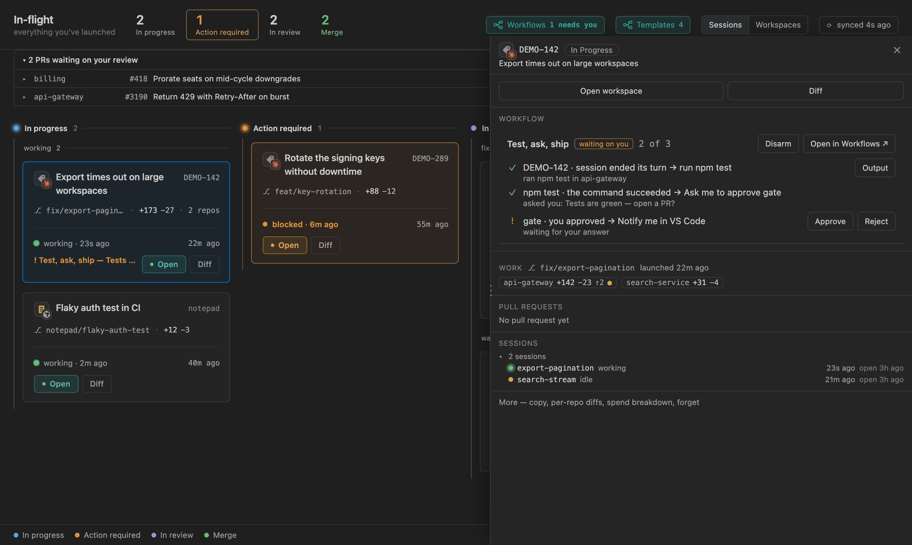

<div align="center">

<picture>
  <source media="(prefers-color-scheme: dark)" srcset="https://github.com/oznasi1/agent-flow/raw/HEAD/media/logo.png">
  <source media="(prefers-color-scheme: light)" srcset="https://github.com/oznasi1/agent-flow/raw/HEAD/media/logo-light.png">
  
</picture>

<p><strong>Run your coding sessions like a fleet.</strong> Take a ticket and the repos it touches
open with Claude Code, Copilot, Cursor or Codex already briefed. Watch every session, PR and
review on one board — and let a workflow test, ask and notify while you work on the next one.</p>

[](https://github.com/oznasi1/agent-flow/actions/workflows/ci.yml)
[](https://marketplace.visualstudio.com/items?itemName=Oznasi1.oznasi1-agent-flow)
[](https://open-vsx.org/extension/Oznasi1/oznasi1-agent-flow)
[](LICENSE)
[](https://buymeacoffee.com/oznasi1)

[](https://vscode.dev/redirect?url=vscode:extension/Oznasi1.oznasi1-agent-flow)
[](https://open-vsx.org/extension/Oznasi1/oznasi1-agent-flow)

[Quick start](#quick-start) · [Full guide](docs/GUIDE.md) · [Settings](docs/SETTINGS.md) · [Privacy](docs/PRIVACY.md) · [Changelog](CHANGELOG.md) · [Report an issue](#feedback)


</div>

---

Agent Flow Deck turns *"what should I work on?"* into a workspace with a session already primed,
and *"what is everything doing?"* into one board.

Pick a task → it infers which repos the task touches → opens them as a workspace →
seeds a task brief and pre-fills your session with the plan. You land ready to orchestrate,
not ready to set up. Then the Deck keeps every launched session, its diff, its PR and its
CI in view, and a workflow can carry a card from "tests are green" to "ask me before the PR"
without you watching it.

## What you can do

- **Take a ticket into a primed session** — from Jira or Salesforce Agile Accelerator
  (`agentFlow.taskSource`), with the repos already selected and the brief on disk.
- **Pick your tool per install or per launch** — Claude Code, GitHub Copilot, Cursor, or the
  OpenAI Codex CLI; `ask` chooses each time (`agentFlow.agentProvider`).
- **Launch several tasks in parallel**, each in its own git worktree and branch, as separate
  windows or tabs in one.
- **Work from a note, not a ticket** — the Notepad starts a session from a line of text and a
  pasted screenshot.
- **See the whole fleet on the Deck** — In progress · Action required · In review · Merge, each
  card with its live session state, diff, PR, CI and ticket status, and the tool driving it.
- **Act from the card** — Fix CI, Resolve conflict, Address review, and (opt-in) Merge a
  provably green PR, each behind a confirmation.
- **Clear your review queue** — every PR waiting on you, with **Review with Claude Code** (or
  your tool) on each row, or hand a batch of them to sessions in one gesture.
- **Attach a workflow to a card** — test when the session ends its turn, ask you at a gate,
  notify when it's merged, with deadlines, retries and a spend ceiling. Off by default.
- **Browse everything Claude Code can do here** — the Marketplace searches your skills, slash
  commands, agents, hooks and plugins and renders each one's file.
- **Keep it yours** — GitHub, GitLab or Bitbucket via your own CLI login; Jira credentials in
  SecretStorage; read-only unless you press a button that says otherwise.

## What it does

### Tasks — the pool

Your project as a filterable pool: **My sprint · Unassigned · Mine · Sprint · Backlog**
(only the lenses your task source has), with a size lens, a status lens, a repo filter and
a fuzzy search that also takes a ticket number or a pasted ticket link. Click a card and
the repos the ticket touches are already selected — read from its components, labels and
text, matched against your local checkouts. Press **▶ Take** and Agent Flow Deck writes a
`.pick-task/TASK.md` brief into each repo, generates a workspace, and pre-fills your
session with the prompt; you press Enter.

Tick several cards and **Launch in parallel** gives every task its own git worktree and
branch, either in separate windows or stacked as tabs in one. **Explore** opens a session
with no ticket at all, and the list can refetch itself on a timer
(`agentFlow.refetchIntervalMinutes`).

### Notepad — work that never had a ticket

<p align="center">

</p>

A plain list of things you want to do — title, detail, checkbox — stored per editor rather
than per workspace, so it follows you between repos. **Start** launches a session from a
note exactly like a ticket would, and the note grows a badge tracking that run. Paste or
drop a screenshot into a note's detail and **Start** copies it beside the brief, so the
session reads what you saw instead of your description of it.

### Deck — the in-flight board


Everything you've launched, in a pipeline — **In progress · Action required · In review ·
Merge**, attention rising left to right. Each card carries the live state: what its session
is doing right now (read from Claude Code's own transcripts), which tool is driving it, the
diff, the PR with its CI and review decision, and the ticket status. The two kinds of
"you're needed" stay apart: **Action required** means a session stopped and cannot resume
on its own, while a PR with red CI, requested changes or a conflict lands in **In review**'s
`fixes needed` lane with **Fix CI**, **Resolve conflict** and **Address review** right on
the card. A PR that is approved, green and mergeable reaches **Merge**, and with
`agentFlow.mergeWrites` on, a **Merge** button that only appears when every fact is
provably green. **Open** focuses that window if it's already open; **Diff** shows the
working tree. The activity-bar icon badges how many sessions are waiting on you, and
`agentFlow.notifyOnActionRequired` turns that into a notification.

Above the columns sits your **review queue**: every open PR waiting on your review, sorted
by oldest or smallest, with **Review with …** (the button names your configured tool, so it
reads **Review with Claude Code**, **Review with Cursor**, **Review with Copilot** or
**Review with Codex**) — a play button on every row — to check one out in a worktree and
have the diff read for you. **Select** several and hand them all to sessions at once; a
`review ready` chip says whose findings are waiting to be read.

### Workflows — let the board act for you



Off by default (`agentFlow.orchestrator`), because an armed workflow eventually starts
sessions and runs commands on its own. Turn it on and every card gets a drawer where you
attach a **workflow**: a small graph of rules, each waiting on a condition — the session
ended its turn, CI passed, the PR merged, a command succeeded or printed a given text, the
tree is clean, the ticket is done — and each doing whatever the node it points at says:
**launch** a planned session in a fresh worktree, **seed** a second session into an
existing one, **run** a shell command, **notify** you in the editor, **ask** you at a gate
with Approve and Reject, or start a saved template as a **subflow**.

Three starters ship built in — **Ship it**, **Test & notify**, **Review only** — and anything
you draw can be saved as a **template** and attached to the next card in one click. A rule
can carry a deadline (**WITHIN**) and an opt-in **RETRY**; a whole workflow can carry a
**spend ceiling** in sessions and commands, or a **token ceiling**; a **dry run** says what
would fire before you arm it. A gate can also post its question on the card's pull request
and take the answer from whoever you named there. A workflow asks before its first launch
and before each distinct command, then runs unattended, and **Schedule the Orchestrator
Tick…** keeps it watching with the editor closed. The full rulebook is in
[docs/GUIDE.md](docs/GUIDE.md#the-deck--your-in-flight-board) and
[docs/ORCHESTRATOR_COMMANDS.md](docs/ORCHESTRATOR_COMMANDS.md).

### Marketplace — everything Claude Code can do here


A searchable, read-only browser over your `~/.claude` — the marketplaces you've added, the
plugins you've installed, and the skills, slash commands, agents and hooks inside them,
plus whatever you wrote yourself. Search is fuzzy (`revw` finds `/review`), and selecting a
row renders its file so you can read what something does without opening it.

**More:** the [full guide](docs/GUIDE.md) covers run retirement, tracking Claude Code
sessions Agent Flow Deck didn't launch, per-task worktrees, prompt modes, child worktrees for
a ticket with sub-tasks, and Remote Control.

## Quick start

> Agent Flow Deck ships with **no organization-specific defaults** — everything it needs is
> collected in a short first-run wizard.

1. **Install the extension** — press **Install in VS Code** or **Install in Cursor** above.
   For a local build instead: `code --install-extension oznasi1-agent-flow-<version>.vsix`,
   or **⋯ → Install from VSIX…** in the Extensions view.
2. **Install a coding tool** — the
   [Claude Code extension](https://marketplace.visualstudio.com/items?itemName=anthropic.claude-code),
   GitHub Copilot (`agentFlow.agentProvider: copilot`), Cursor's own agent (`cursor`), or the
   OpenAI Codex CLI (`codex`). With none, the task brief is still written as a fallback.
3. **Open the Agent Flow Deck icon** in the activity bar and complete the setup — your Jira
   site, project key, and repos directory, then an
   [Atlassian API token](https://id.atlassian.com/manage-profile/security/api-tokens).
   (Re-run it anytime with **"Run Setup…"**; Agile Accelerator users set
   `agentFlow.taskSource` instead — see [docs/CONNECTORS.md](docs/CONNECTORS.md).)
4. **Pick a task**, check the inferred repos, and press **▶ Take**.
5. **Land in a primed workspace** — brief on disk, prompt pre-filled. Press **Enter**.

## Requirements

- **VS Code** (or Cursor) `^1.90.0`.
- A **coding tool** for the seed — the Claude Code extension, Copilot in VS Code, Cursor's
  agent in Cursor, or the Codex CLI on your PATH. Optional: the brief is the guaranteed
  fallback.
- An **Atlassian API token** for your Jira Cloud account
  ([create one](https://id.atlassian.com/manage-profile/security/api-tokens)), or an
  Agile Accelerator login for that source.
- Your **forge's CLI**, signed in — `gh` for GitHub, `glab` for GitLab, or `atlassian-cli`
  for Bitbucket Cloud (`agentFlow.forge`). Optional, for the Deck's PR/CI state and review
  queue; without it the Deck falls back to git + your task source. See
  [docs/FORGES.md](docs/FORGES.md) for what GitLab and Bitbucket cannot answer.

## Settings

The ten that matter to start. The rest are in the Settings UI under `agentFlow`, and
documented in [docs/SETTINGS.md](docs/SETTINGS.md).

| Setting | Default | Notes |
|---------|---------|-------|
| `agentFlow.taskSource` | `jira` | Where tasks come from: `jira` or `agileAccelerator`. |
| `agentFlow.jira.baseUrl` | `""` | Your Jira Cloud site, e.g. `https://your-org.atlassian.net`. |
| `agentFlow.jira.project` | `""` | Jira project key, e.g. `ABC`. |
| `agentFlow.reposRoot` | `~/projects` | Where your repo checkouts live. |
| `agentFlow.agentProvider` | `claude-code` | Which tool starts a session: `claude-code`, `copilot` (VS Code only), `cursor` (Cursor only), `codex` (its CLI, any editor), or `ask` to pick per launch. |
| `agentFlow.agentSurface` | `extension` | The tool's chat panel, or `terminal` for its CLI. |
| `agentFlow.forge` | `github` | Where your pull requests live: `github` (via `gh`), `gitlab` (via `glab`) or `bitbucket` (via `atlassian-cli`). |
| `agentFlow.openIn` | `ask` | Where a task opens: a new window, this one, or an existing workspace. |
| `agentFlow.notifyOnActionRequired` | `false` | Notify when a run enters Action required, once until it's answered and parks again. |
| `agentFlow.orchestrator` | `false` | Show Workflows and Templates on the Deck. Off until you turn it on, because an armed workflow acts on its own. |

## Privacy

Agent Flow Deck talks to **your** task source, reads your **local** checkouts, and reads
your forge through your **existing** `gh`, `glab` or `atlassian-cli` login — nothing about
your tickets, code or repos goes anywhere that isn't already yours. Jira credentials live in VS Code
**SecretStorage**, never in `settings.json`. Both are **read-only by default** — the only
writes are ones you trigger yourself: a Jira status change from a card; with
`agentFlow.reviewWrites` on (it ships off), a review submitted from the Deck behind a
confirmation dialog; or, with `agentFlow.mergeWrites` on (off too), a provably green pull
request merged from its card behind one; and a workflow's launches and shell commands,
which ask first. Briefs go in a git-excluded `.pick-task/`, so they never get committed.

Full disclosure: [docs/PRIVACY.md](docs/PRIVACY.md). Anonymous usage telemetry is separate
and described below.

## Feedback

Found something broken? [Open a bug report][bug] — the form asks for a **Doctor** report,
which probes Jira and `gh` for real and is usually enough to find the fault on the first
read. Want it to do something it does not? [Open a feature request][feat] and describe the
workflow that is currently awkward rather than the button you think is missing. Security
issues go through a [private advisory][sec], never a public issue.

[bug]: https://github.com/oznasi1/agent-flow/issues/new?template=bug_report.yml
[feat]: https://github.com/oznasi1/agent-flow/issues/new?template=feature_request.yml
[sec]: https://github.com/oznasi1/agent-flow/security/advisories/new

## Develop

```bash
npm install
npm run build        # or: npm run watch
npm test             # vitest
npm run typecheck    # tsc --noEmit
```

Press **F5** to launch an Extension Development Host with the extension loaded. See
[CONTRIBUTING.md](CONTRIBUTING.md) for the architecture, conventions, and the full command
list — contributions welcome.

## Telemetry

Agent Flow Deck sends anonymous usage and error events (which features are used, where a
flow gets abandoned, what fails) to a personal PostHog project — never repo names, ticket
keys, file paths, prompt text or error messages. Turn it off with
`agentFlow.telemetry.enabled`; VS Code's own `telemetry.telemetryLevel` is always honoured.
See [docs/TELEMETRY.md](docs/TELEMETRY.md) for the itemized disclosure.

## Status

v1, released several times a week. See [CHANGELOG.md](CHANGELOG.md) for the release
history. Deferred: OAuth web sign-in, cloning not-yet-checked-out repos, multi-project.

## Support

Agent Flow Deck is free and MIT-licensed, built and maintained in my spare time. If it
saves you time, you can [buy me a coffee](https://buymeacoffee.com/oznasi1) ☕ — it keeps
the releases coming.

## License

[MIT](LICENSE) © 2026 Oz Nasi ([oznasi1](https://github.com/oznasi1)).
