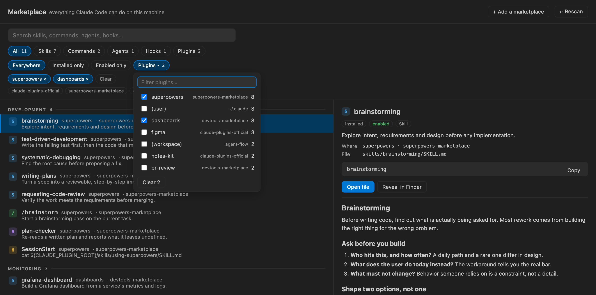

<div align="center">

<picture>
  <source media="(prefers-color-scheme: light)" srcset="https://github.com/oznasi1/agent-flow/raw/HEAD/media/logo-light.png">
  
</picture>

<p><strong>A task pool in your sidebar.</strong> Take a Jira ticket and it opens the repos
that ticket touches, with a Claude Code agent already briefed.</p>

[](https://github.com/oznasi1/agent-flow/actions/workflows/ci.yml)
[](LICENSE)


</div>

---

Agent Flow Deck turns *"what should I work on?"* into a workspace with an agent already primed.

Pick a Jira task → it infers which repos the task touches → opens them as a workspace →
seeds a task brief and pre-fills a Claude Code agent with the plan. You land ready to
orchestrate, not ready to set up.

## What it does

- **Sidebar task pool** (webview) with filter tabs (My sprint · Unassigned · Mine ·
  Sprint · Backlog) and a size lens (S/M/L by original estimate). The size lens, status
  lens, and repo search can each be hidden if you don't use them (`agentFlow.filters.size` /
  `.status` / `.repo`, all on by default).
- **Jira fetch** over the REST API. Reads are the default; the only writes are optional
  status changes from a card — which also stamp a provenance label (default `claude-code`,
  configurable via `agentFlow.provenanceLabel`, toggle with `agentFlow.stampLabelOnWrite`).
- **Service inference** — reads the ticket's components/labels/text and matches your
  local repo checkouts (backend *and* frontend).
- **Open + seed** — writes `.pick-task/TASK.md` into each repo (git-excluded), generates a
  `<KEY>.code-workspace` (or one window per repo, or a per-task git worktree), and pre-fills
  the Claude Code panel with your chosen prompt mode (you press Enter to start).
- **Address PR** — once a task reaches your PR-review status (default `PR initiated`), an
  **Address PR** button appears on the card. From the sidebar's task card it kicks off an agent
  **in a fresh worktree**; from a Deck card it re-seeds the workspace that run already has
  instead, asking nothing, since the run was launched with one. Either way the agent finds the
  task's GitHub PR by its Jira key, checks out its branch, and assesses whether it's ready
  for your fixes — then, by default, starts implementing the requested changes (toggle with
  `agentFlow.prReviewAutoFix`).
- **Review queue** — a strip on the Deck lists every open PR that asks for *your* review,
  sortable by oldest or smallest, with per-row size, CI and age. **Review with agent** checks
  one out into a worktree and seeds an agent to review it; submitting the review itself from
  the Deck is opt-in and ships **off** (`agentFlow.reviewWrites`).
- **Launch in parallel** — filter the repo lens to one repo **or several** and a checkbox
  appears on each task. Tick a few, then **Launch in parallel**: each task gets its own git
  worktree (its own branch) in whichever of the filtered repos it's inferred to touch — or
  in all of them, when the ticket names none, so no task launches with no repo. You're
  asked once where the batch goes (the same destinations a single **Take** offers), and for
  a new window, how to lay it out: **separate windows**, one per task, or **one shared
  window** holding every task's worktrees with a Claude Code session seeded per task,
  stacked as tabs in one Claude group in the order you picked them. Every other destination
  *is* a single window, so it goes straight to the shared layout. Batches larger than
  `agentFlow.batchLaunchConfirmThreshold` (default 6) ask first.

### The Deck — your in-flight board

Once you've taken tasks, the **Deck** (open it with **"Open the Deck (in-flight)"**)
is the board of everything you've launched, in a classic pipeline —
**In progress · Action required · In review · Done**.


The columns are a neutral git + Jira backbone; each **card** carries the true live state.
A best-effort **Live signal** (read from your local Claude Code transcripts) tells `working ·
Ns ago` from `idle`, `ended turn` (needs you), or `parked` — a card only reads `parked` when
its transcript can't be read, or doesn't exist yet, which is the one route back to the git +
Jira backbone. **Open** focuses the window if it's already open (never a duplicate) and
opens it fresh otherwise; **Diff** shows the working diff; **⋯** offers *Open in Jira* and
*Forget*.

The board opens with **one card per Claude Code agent** — its live state and
session name lead, and the repo, branch, Jira key and pull request it belongs to
sit underneath, so two agents in one worktree read as two different pieces of
work, in whichever columns their own states put them. **Open** and **Diff** on
such a card act on that agent's own directory. Switch the header control to
**Workspaces** for one card per launched task with its agents nested instead;
whichever you pick sticks.

Run records retire themselves once a task is provably over: its directories are
gone, it landed a day ago with no agent left in it, or it is an old session with
no ticket, no PR and nothing uncommitted. Uncommitted or unpushed work always
stops a record being retired, and retirement only ever deletes Agent Flow's own
pointer — never a worktree, a branch, or a commit. **Clear stale** appears in the
header when records are only waiting out their window, and takes them on the spot.

The Deck also shows **every Claude Code session open on this machine**, not only
the ones it launched — read from `~/.claude/sessions`, the registry Claude Code
keeps of its running sessions. Sessions attach to the card that owns their
directory, so a worktree with two agents in it lists both, in the order you
opened them; a place with no tracked run of its own gets a card of its own,
marked `local`. A local card reads its branch for a ticket key
(`ASM-5641-team-table` → `ASM-5641`, marked `~inferred` since a branch can name
a ticket somebody else owns) and for its pull request, so a worktree Claude Code
made on its own lands on the board as complete as one you took. It disappears
the moment you close its last agent — **⋯** → **Track it** pins it to the runs
store first, and from there it behaves exactly like a task you took, **Forget**
included. Turn it off with `agentFlow.openAgents`, which the board picks up
immediately — no need to close and reopen the panel.

Each card also carries the **PR state** of every repo it touches, read from GitHub
with the `gh` CLI: the PR number, CI (failing check names link to their runs, or a
passing count), the review decision with any unresolved-thread count, and
mergeability. A PR that needs a human decision — failing required checks,
requested changes, or a conflict — pulls its card into **Action required**, even while
the agent is still working, because an agent can't know CI broke until you tell
it. A merged PR moves the card to **Done** and is the only thing that makes a card
say *merged*. Turn it off with `agentFlow.prFacts`, applied the moment you save
the setting, and cards fall back to the git + Jira backbone.

Above the columns sits your **review queue** — every open PR that asks for your
review, found with one `gh` search. PRs in archived repositories are left out:
an archived repo is read-only, so GitHub refuses a review on one, and those
requests otherwise sit in the queue forever. Every row is visible in a height-capped,
independently scrollable list rather than being collapsed away, so a nine-request
queue is still a scroll, not a count. Each row carries the repo, PR number, title,
author, age, and its size both as `+409 −50 · 8 files` and as an S/M/L bucket;
sort by **oldest** (what you owe most) or **smallest** (what you can clear before
standup). Expanding a row fetches which checks failed and how many review threads
are still open, alongside the review decision and mergeability. **Review with agent**
checks the PR out into a worktree and seeds
Claude Code to review the diff and write its findings to
`.pick-task/REVIEW-<number>.md`, which the row can then load into the review box.
Turn the strip off with `agentFlow.reviewRequests`; it also goes dark whenever
`agentFlow.prFacts` is off, since both lean on the same `gh` dependency.

With `agentFlow.reviewWrites` on (**off by default**), the expanded row also
submits: **Approve**, **Comment**, or **Request changes** — each disabled while a
submit for that row is already in flight, and each behind a confirmation dialog
that names the verb, the repo and the PR number before anything is sent. A body
loaded from the agent's draft is marked as agent-drafted when it goes out, unless
you turn `agentFlow.stampLabelOnWrite` off.

### The Marketplace — browse your skills, commands & agents

The **Marketplace** (open it with the puzzle-piece (`$(extensions)`) button beside the
Deck's button in the sidebar title bar, or **"Open the Marketplace"**) is a
searchable browser of everything Claude Code can do on this machine. It reads your local
`~/.claude` — the marketplaces you've added, the plugins you've installed, and the skills,
slash commands, agents and hooks inside them — plus any skills or commands you wrote
yourself in `~/.claude` or in the open workspace's `.claude/`.


Search is fuzzy and ranked — `revw` finds `/review`, `mkpl` finds `marketplace` — with the
best match selected as you type and the type tallies following the query. From the search
box, **↑/↓** move the selection and **Enter** opens its file. When you aren't searching,
the list groups into **category sections** read from each plugin's own manifest —
Development, Monitoring, Deployment, and so on — with everything you wrote yourself under
**Yours** first, the rest ordered by descending size, and anything whose manifest omits
the field under **Uncategorized** last. Click a section header to focus that category.

Narrow further by type, by what's installed or enabled, by **several plugins at once**
(the searchable `Plugins ▾` picker, or click a plugin name in any row), or by marketplace
(click its tag). Query, type, scope, category, plugins and marketplace all AND together,
and active selections show up as removable chips with a **Clear** action — the chip row
disappears when nothing is selected.



It also shows which plugins are disabled, and lists the plugins your marketplaces
catalogue but haven't downloaded yet, with the `/plugin install` command to get them.

Selecting a row **renders its file** in the pane on the right, under the metadata — a
skill's `SKILL.md`, a hook's `hooks.json` as a fenced JSON block, a plugin's README — so
you can read what something actually does without opening it; **Open file** still opens it
in an editor tab, **Reveal in Finder** shows it on disk, and **Copy** grabs the command
you'd type to use it. Files over 262,144 characters are truncated, with the same **Open
file** button covering the rest in the editor. The renderer builds elements from a parsed
tree instead of injecting HTML, so a hostile file from a third-party marketplace can't run
anything; only `http`/`https` links become clickable.

The panel is **read-only and offline** — it never writes to `~/.claude`, never runs
`/plugin install`, and makes no network calls to populate itself (opening it is a
tracked command like any other — see [Telemetry](#telemetry)). **⟳ Rescan** re-reads the disk (so does
coming back to the panel after a pause), and **+ Add a marketplace** copies the
`/plugin marketplace add owner/repo` command for you to run in Claude Code itself — new
marketplaces show up here on the next scan.

## Quick start

> Agent Flow Deck ships with **no organization-specific defaults** — everything you need is
> collected in a short first-run wizard.

1. **Install the extension.**
   - Build or grab the packaged `.vsix` (see [Develop / run](#develop--run) or
     [CONTRIBUTING.md](CONTRIBUTING.md)), then:
     ```bash
     code --install-extension oznasi1-agent-flow-<version>.vsix
     ```
     …or in the Extensions view use **⋯ → Install from VSIX…**.
   - _(Once published, you'll also be able to install it from the VS Code Marketplace.)_
2. **Install the [Claude Code extension](https://marketplace.visualstudio.com/items?itemName=anthropic.claude-code)**
   (`anthropic.claude-code`) — Agent Flow Deck seeds its agent panel. Without it, the task brief
   is still written and used as a fallback.
3. **Open the Agent Flow Deck icon** in the activity bar. On first activation it offers a guided
   setup — enter your Jira site, project key, and repos directory, then sign in with an
   [Atlassian API token](https://id.atlassian.com/manage-profile/security/api-tokens).
   (Re-run it anytime with **"Run Setup…"**.)
4. **Pick a task** from the pool. Click a card to expand it — the inferred repos are
   pre-selected; adjust them, then press **▶ Take**.
5. **Land in a primed workspace.** Agent Flow Deck opens the task's repos, drops a
   `.pick-task/TASK.md` brief into each, and pre-fills the Claude Code panel with your
   prompt — press **Enter** to start.

## Requirements

- **VS Code** (or Cursor) `^1.90.0`.
- The **Claude Code** extension (`anthropic.claude-code`) — for the agent seed (optional;
  the task brief is the guaranteed fallback).
- An **Atlassian API token** for your Jira Cloud account
  ([create one](https://id.atlassian.com/manage-profile/security/api-tokens)).
- The **`gh` CLI**, signed in (`gh auth login`) — for the Deck's PR/CI state
  (optional; without it the Deck falls back to git + Jira) and its
  review-requests strip (optional; without it the strip simply has no data and
  doesn't render — there's no git or Jira equivalent for "who's asking for my
  review"). Found on your `PATH`
  or in the usual install dirs (`/opt/homebrew/bin`, `/usr/local/bin`,
  `/opt/local/bin`, `~/.local/bin`, `~/bin`) — the editor does not always hand
  extensions your shell's `PATH`. If the Deck still says gh is missing, the
  **Agent Flow Deck** output channel logs the binary it tried and what it said.

## Data & privacy

Agent Flow Deck talks to **your** Jira Cloud site, reads your **local** repo checkouts,
and — when `agentFlow.prFacts` is on — reads your **own** GitHub through your
existing `gh` login. The review-requests strip shares that same gate rather than
adding a new one: `agentFlow.reviewRequests` only produces a GitHub read while
`agentFlow.prFacts` is also on, so turning PR facts off silences the strip too,
regardless of its own setting. Nothing about your tickets, code or repos is sent
to any service that isn't already yours, and Agent Flow Deck stores no GitHub
credentials of its own: every GitHub call goes through `gh`, so it inherits
whatever host, SSO and token your CLI already
has. When `agentFlow.openAgents` is on, the Deck also reads `~/.claude/sessions` —
Claude Code's own local registry of what's running — to find sessions it didn't
launch; nothing in that registry leaves your machine either, but when `agentFlow.prFacts`
is also on, a session sitting on a feature branch gets the same `gh pr list` (and,
when needed, `gh api graphql`) read run *in that directory* too — even one you never
pointed Agent Flow Deck at, like an OSS clone, a client checkout, or another team's repo.
Separately, Agent Flow Deck
also sends anonymous *usage* telemetry (not any of the above) — see
[Telemetry](#telemetry) below.

GitHub access is **read-only by default** — Agent Flow Deck never merges or pushes.
The one exception is opt-in: with `agentFlow.reviewWrites` on (it ships **off**),
the Deck's review strip can submit a review — approve, comment, or request
changes — on a PR that asked for yours. Every submit shows a modal confirmation
naming the verb, the repo and the PR number before anything reaches GitHub, and
every submit attempt — success or failure — is logged to the **Agent Flow Deck**
output channel. A review body loaded from the agent's draft is marked as
agent-drafted when it goes out (a fixed line, not the configurable
`agentFlow.provenanceLabel`), unless `agentFlow.stampLabelOnWrite` is off.
Nothing else about the feature writes anywhere: the review agent itself is told,
in its seeded prompt, not to post anything to GitHub — the human submits the
review.

The **Doctor** command probes rather than only reading config: it makes two
authenticated GETs to your own Jira site and runs `gh auth status`, which is what
catches a revoked token instead of reporting it as a network problem. It writes
nothing anywhere except your clipboard, and only when you ask it to copy the
report. Your Jira credentials are stored in VS Code **SecretStorage** (encrypted),
never in `settings.json`. Reads are the default; the only Jira **writes** are the
optional status changes you trigger from a card (which stamp the provenance
label). Task briefs are written to a git-excluded `.pick-task/` directory in each
repo, so they never get committed.

## Settings

| Setting | Default | Notes |
|---------|---------|-------|
| `agentFlow.jira.baseUrl` | `""` | Your Jira Cloud site, e.g. `https://your-org.atlassian.net`. |
| `agentFlow.jira.project` | `""` | Jira project key, e.g. `ABC`. |
| `agentFlow.reposRoot` | `~/projects` | Where your repo checkouts live. |
| `agentFlow.workspaceDir` | `~/projects` | Where generated `.code-workspace` files go. |
| `agentFlow.repoBlocklist` | `[]` | Directory names under `reposRoot` to exclude from discovery. |
| `agentFlow.githubOrg` | `""` | Reserved (clone support not yet implemented). |
| `agentFlow.provenanceLabel` | `claude-code` | Label stamped on Jira writes when enabled. |
| `agentFlow.stampLabelOnWrite` | `true` | Whether to stamp the provenance label on a Jira write, and whether a review body submitted from the Deck is marked as agent-drafted (a fixed line, distinct from `agentFlow.provenanceLabel`). |
| `agentFlow.defaultFilter` | `mysprint` | Default task filter lens (`unassigned`, `mysprint`, `mine`, `sprint`, `backlog`). |
| `agentFlow.seedAgent` | `true` | Pre-fill the Claude Code panel after opening. |
| `agentFlow.agentSurface` | `extension` | Where a session starts: the Claude Code extension panel, or `terminal` to run the `claude` CLI in an integrated terminal. Either way the prompt is pre-filled and you press Enter. |
| `agentFlow.trackOpenWindows` | `true` | Track open windows so a task can open into one you already have open. |
| `agentFlow.prFacts` | `true` | Read each in-flight task's PR state from GitHub via the `gh` CLI and show it on the Deck's cards. |
| `agentFlow.openAgents` | `true` | Show every Claude Code session open on this machine on the Deck: as agents on the card that owns their directory, and as a `local` card of its own for a place Agent Flow Deck never launched. Read from `~/.claude/sessions`. |
| `agentFlow.prFactsTtlSeconds` | `120` | How stale a cached PR fact may be before the Deck re-fetches it (minimum 30). Only fetched while the Deck is open. |
| `agentFlow.deckGrouping` | `agents` | One card per agent, or per launched task (`workspaces`). |
| `agentFlow.retireFinishedAfterHours` | `24` | How long landed work stays on the board after its last agent closes. `0` retires on sight. |
| `agentFlow.retireAbandonedAfterDays` | `7` | How long a ticketless, PR-less, clean run may sit before its record is deleted. `0` disables it. |
| `agentFlow.prReviewStatus` | `PR initiated` | Task status (case-insensitive) that shows the **Address PR** button on a card. |
| `agentFlow.prReviewAutoFix` | `true` | After the PR-review agent assesses the PR, let it implement the requested changes (off = assess only). |
| `agentFlow.reviewRequests` | `true` | Show the Deck's review-requests strip: open GitHub PRs that ask for your review. |
| `agentFlow.reviewRequestsTtlSeconds` | `300` | How stale the cached review queue may be before a refetch (minimum 60). |
| `agentFlow.reviewWrites` | `false` | Allow submitting approve / comment / request changes to GitHub from the Deck. |
| `agentFlow.reviewRequestModes` | *(one built-in mode)* | Seed modes offered by **Review with agent**, layered over the built-in one. Add your own — e.g. separate backend and frontend review modes — and clicking asks which to use. |
| `agentFlow.reviewRequestMode` | `ask` | Pin one review mode by `id` to skip the question. |
| `agentFlow.remoteControl` | `off` | Offer Claude Code's **Remote Control** for the session Agent Flow Deck opens (`off` / `on` / `ask`), so you can drive it from claude.ai or the Claude mobile app. |
| `agentFlow.environments` | `["dev", "staging", "production"]` | Environments offered by the **Verify on an environment** Explore action. The picker also offers **Custom…** for a one-off. |

Plus `agentFlow.workspaceMode`, `agentFlow.taskMode`, `agentFlow.promptModes`,
`agentFlow.exploreMode`, `agentFlow.explorePrompts.*`, `agentFlow.prReviewPrompt`, and
`agentFlow.worktree` — see the Settings UI. Taking a task asks how the agent should
start: **Plan first**, **Implementation**, **Test-driven**, **Investigate &
root-cause**, **Orchestrator**, or **Refine the ticket**. Edit those prompts, or add your own mode, under
`agentFlow.promptModes`; pin one with `agentFlow.taskMode` to skip the question.
Your entries layer over the built-in modes rather than replacing them — reuse a
built-in `id` to override just the fields you set, and add `"hidden": true` to an
entry to drop that built-in — so modes added in a later release still reach you. **Explore** asks what kind of session to start: **Open a Jira ticket**, **Enhance
knowledge / flow**, **Debug**, **General**, **Supervise running tasks**, or **Verify on an environment**. Verify also
asks which environment to check the repos you picked against — from
`agentFlow.environments`, or a one-off you type — and seeds a read-only prompt that
inspects their logs, error rates, metrics and traces, and deployed version there. Edit any Explore prompt
under `agentFlow.explorePrompts.*`, or pin one action with `agentFlow.exploreMode`.
**Review with agent** works the same way on its own list: one **Full review** mode ships,
and once you add one of your own — a backend-services reviewer, say — clicking asks which to
seed, since your entry joins **Full review** rather than replacing it. Pin one with
`agentFlow.reviewRequestMode`. The sidebar's **Address PR**
kick-off always runs in a fresh worktree; a Deck card's re-seeds that run's existing workspace
in place instead — whatever `agentFlow.worktree` gave it when it was
launched. Per-task worktrees are created inside each repo at
`.claude/worktrees/<KEY>` (and git-excluded automatically).

**Remote Control.** With `agentFlow.remoteControl` set to `on` or `ask`, the Claude Code
panel is pre-filled with `/remote-control <KEY>` instead of the task prompt, and the task
prompt goes to your clipboard: press Enter to connect the session, then paste and press
Enter to start the task. The Jira key names the remote session, so several are tellable
apart on claude.ai. It takes two steps because Claude Code can't run a slash command and a
prompt in one submission. It applies only where a single clipboard can carry the prompt: a
per-window Take across several repos keeps the normal single-Enter seeding, since one
clipboard can't hold a different prompt for each window — and so does any launch into a
**shared window**, batch or single task, because each session there is seeded from its own
plan file with no clipboard paste to attach to. Either way the toast says Remote Control
was skipped, so you're never left waiting for a `/remote-control` prompt.

### Where a task opens

`agentFlow.openIn` controls where a task you take gets opened: `ask` (ask each time),
`new-window`, `this-window` (start a session in the window you're already in), or
`pick-existing` — pick an existing `.code-workspace` file to open the task into. Repos
the workspace already has a folder for (matched by name) are skipped automatically and
named in the toast — a worktree keeps its repo's bare name, so adding it anyway would
grow a second root by that name. Anything genuinely new is added only after you approve
it in a prompt; declining leaves the file byte-identical. Either way the workspace's
existing folders, settings, and formatting are preserved and it opens as a multi-root
workspace.

`this-window` never replaces what's open. The window keeps its folders, its editors and
any session already running in it, and the task's agent starts alongside them. A window
Agent Flow can't name — an empty one, or several folders with no saved
`.code-workspace` — can't hold a seeded session, so **This window** isn't offered there
and `this-window` opens a new window instead.

When taking a task (or starting an Explore session) with `agentFlow.openIn` set to
`ask`, Agent Flow Deck also lists the windows you already have open — a repo folder or a
saved workspace — so you can drop the task straight into one of them. Choosing an open
**workspace** window offers to add any genuinely new repos to it (the same skip-and-approve
behavior above); choosing an open **folder** window focuses it and seeds the agent there
(a folder window can't gain root folders, so any other repos the task touches keep their
briefs but aren't added as roots). Set `agentFlow.trackOpenWindows` to `false` to turn
this off.

### Where the session opens

Two settings, two different questions. `agentFlow.openIn` decides **which window** a
task lands in. `agentFlow.agentSurface` decides **what starts the session** once it's
there:

- `extension` (default) — the Claude Code extension panel, prompt pre-filled.
- `terminal` — an integrated terminal named `Claude · <KEY>` running the `claude`
  CLI, prompt pre-typed.

Either way you press Enter to start, and both work for every launch path: taking a
task, batch launches, Explore, Notepad, and **Address PR**. Terminal mode needs
`claude` on your `PATH`; if it isn't, the terminal says `command not found` and the
prompt is still sitting there to reuse.

## Architecture

```
src/
├── extension.ts        # activation, commands, first-run + seed-on-activation hooks
├── setup.ts            # guided first-run configuration wizard
├── tasksView.ts        # sidebar webview provider + the pick→confirm→open flow
├── deckView.ts         # the Deck panel: in-flight runs, live signal, open/diff
├── marketplaceView.ts  # the Marketplace panel: scan, file reads, open/reveal/copy
├── config.ts           # settings accessor
├── types.ts            # shared host ↔ webview message types
├── jira/
│   ├── auth.ts         # JiraAuth interface + ApiTokenAuth (SecretStorage)
│   ├── client.ts       # REST client: search, getIssue, transitions
│   └── jql.ts          # the JQL behind each filter lens
├── engine/             # the logic, kept out of the views so it can be tested directly
│   ├── repos.ts        # discover local repo checkouts
│   ├── infer.ts        # component/label/text → service matching
│   ├── worktree.ts     # per-task git worktrees + branch naming
│   ├── workspace.ts    # briefs, .code-workspace, plan.json, open windows, agent seed
│   ├── runs.ts         # what you've launched, for the Deck
│   ├── transcript.ts   # best-effort live agent state from ~/.claude/projects
│   ├── claudeAssets.ts # scan ~/.claude: marketplaces, plugins, skills, commands, hooks
│   ├── sections.ts     # the Marketplace's category order (Yours → size → Uncategorized)
│   ├── fuzzy.ts        # the ranked fuzzy match behind the Marketplace's search
│   └── markdown.ts     # the parse-to-tree markdown renderer behind the file preview
└── webview/            # React UIs — task pool, Deck, Marketplace (three esbuild bundles)
```

Auth is behind the `JiraAuth` interface: v1 ships the API-token provider; the OAuth
web-flow provider (a `vscode.AuthenticationProvider` that opens the browser) drops in later
with no changes to the client or UI.

## Develop / run

```bash
npm install
npm run build        # or: npm run watch
npm test             # vitest
npm run typecheck    # tsc --noEmit
```

Press **F5** (Run Agent Flow Deck) to launch an Extension Development Host with the extension
loaded. Open the **Agent Flow Deck** icon in the activity bar and complete the first-run setup.

See [CONTRIBUTING.md](CONTRIBUTING.md) for the full command list and conventions.

## Status

v1 — task pool, filters, size lens, service inference, worktrees, open + seed, and status
changes from a card, plus the **Deck** (the in-flight board) and the **Marketplace** (the
read-only browser over `~/.claude`). The agent seed calls the Claude Code extension command
(`claude-vscode.primaryEditor.open`) with a URI-handler and clipboard fallback; the seeded
brief is the guaranteed fallback. Deferred: OAuth web sign-in, cloning not-yet-checked-out
repos, multi-project.

See [CHANGELOG.md](CHANGELOG.md) for the release history.

## Publishing

Before publishing to the VS Code Marketplace, confirm the `publisher` in `package.json`
matches your registered Marketplace publisher id and that a 128×128 PNG `icon` is set. See
[CONTRIBUTING.md](CONTRIBUTING.md#publishing-maintainers).

## Contributing

Contributions are welcome — see [CONTRIBUTING.md](CONTRIBUTING.md).

## Telemetry

Agent Flow Deck sends anonymous usage and error events (which features are used, where
a flow gets abandoned, what fails) to a personal PostHog project, to help decide
what to build next — never repo names, ticket keys, file paths, prompt text or
error messages. Turn it off with `agentFlow.telemetry.enabled`, and VS Code's own
`telemetry.telemetryLevel` is always honoured too (`"error"` sends only failures,
`"off"` sends nothing). See [docs/TELEMETRY.md](docs/TELEMETRY.md) for the
complete, itemized disclosure.

## License

[MIT](LICENSE) © 2026 Oz Nasi ([oznasi1](https://github.com/oznasi1)) and At-Bay.
